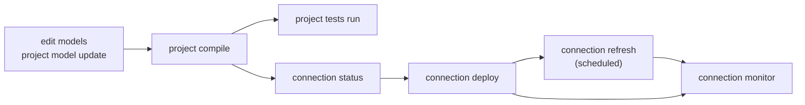

# Concepts: project and connection, deploy and refresh

> **Status, 2026-10-07.** This page describes the model the tool is being moved to (`docs/research/lifecycle-model.md`). The command names below are the destination; `docs/research/lifecycle-implementation.md` says which are built. `docs/commands.md` is generated from the program and is always what exists now.

## The two things you work on

* A **project** is a directory of models. Working on it is **offline**: it reads and writes files and never opens a database.
* A **connection** is a database the project is built on. Working on it is **online**.

## The four questions you ask of a connection

| You want to know or do | Command | Changes the database? |
|---|---|---|
| Where does it stand? | `dbdatabuild connection status <c>` | no |
| Make its structure match the models | `dbdatabuild connection deploy <c>` | **structure** (tables, views, indexes) and the tracking tables |
| Bring its data up to date | `dbdatabuild connection refresh <c>` | **data**, never structure |
| What happened? | `dbdatabuild connection monitor <c>` | no |

*Deploy* is rare, reviewed, and records what it changed. *Refresh* is frequent, usually unattended, and repeats the same statements. A refresh that would need a structure change stops and tells you to deploy.



## What a command reads and writes

Every command says, in its header and in `--help`, what it touches:

| Code | Reads | Writes | In words |
|---|---|---|---|
| `P→` | project | nothing | safe to run any time |
| `P⇒P` | project | project files | edits or generates files |
| `C→` | connection | nothing | reads the database only |
| `C→P` | connection | project files | reads the database to write files |
| `P⇒T` | project | tracking tables | records metadata or a decision |
| `P⇒S` | project, connection | **structure** | changes what exists |
| `P⇒D` | project, connection | **data** | moves data |
| `—` | nothing | nothing | reference text, or a server that hosts commands |

## Commands

### Working on the project (offline)

| Command | What it does | Disposition |
|---|---|---|
| `project create <dir>` | start a project from a template | `P⇒P` |
| `project model create <schema.object>` | add a model | `P⇒P` |
| `project model update [models]` | write or update the definitions of models from their queries | `P⇒P` |
| `project compile [models]` | check the project and write the compiled files (`rendered/`, refresh plans); `--check` for CI | `P⇒P` |
| `project tests run [tests]` | run the project's tests | `P→` |
| `project sample <models>` | run models on sample data | `P→` |
| `project seed` | build the sample source data | `P⇒P` |
| `project import <c> [tables]` | export a connection's tables as models | `C→P` |
| `project show loads\|graph\|metadata\|plan` | read-only views | `P→` |
| `project agent-kit` | install the skill for AI agents | `P⇒P` |

### Working on a connection (online)

| Command | What it does | Disposition |
|---|---|---|
| `connection inspect <c>` | can the tool use this connection, and if not why | `C→` |
| `connection init <c>` | create the tracking tables | `P⇒T` |
| `connection status <c>` | structure, data and what needs attention | `C→` |
| `connection deploy <c>` | change structure (interactive; or `--write-plan` then `--apply-plan`) | `P⇒S` |
| `connection refresh <c>` | run the routine loads | `P⇒D` |
| `connection monitor <c>` | the timeline of deploys and refreshes | `C→` |
| `connection compare <c> <table>` | compare the data of two tables | `C→` |
| `connection seed <c>` | put sample data into a sandbox database | `P⇒S` |
| `connection publish <c>` | store the project's metadata in the database | `P⇒T` |

### Interfaces and help

| Command | What it does |
|---|---|
| `ui terminal`, `ui web`, `ui mcp` | the terminal interface, the web page, the MCP server for AI agents |
| `help code <code>` | explain a diagnostic such as `DDB-214` |
| `help matrix` | the support matrix |

## Plans and events

A **plan** is a list of steps (statements, their risk and why). An **event** is one run of a plan. Ten refreshes a day are ten events that point at one plan.

* A **deploy plan** is made from the database's live state, so it can go stale. It is shown to you, you give the allowances for risky steps, and it is applied. A completed deploy plan cannot be applied twice. If a deploy stops part-way, running the same plan again continues it.
* A **refresh plan** is made when you compile, from the project alone, and is committed like code: it documents how the project operates every day. Values only known at run time (watermarks) are recorded in the event, not in the plan.

Where plans are kept, and how much is recorded, is the project's choice:

```yaml
plans:
  deploy:  { keep: committed, audit: full }      # plans/ in git, text also in the database
  refresh: { keep: committed, audit: standard }  # compiled plan in git; each event stores the plan hash
connections:
  dev:  { plans: { deploy: { keep: ephemeral, audit: minimal } } }   # made and applied in one step
```

| `keep` | In the project | In the database |
|---|---|---|
| `committed` | a file | yes |
| `database` | no | yes (made by one person or job, applied by another) |
| `ephemeral` | no | the hash only |

| `audit` | Recorded |
|---|---|
| `minimal` | the event and its steps |
| `standard` | adds the plan's hash, who ran it and the commit |
| `full` | adds the plan text and the statement log |

The tool records what happened to match the policy. It does not decide who reviews or approves.

## Before a refresh runs

A refresh can run without asking the database anything, or check first. The project's `refresh.check` (and `--check`) chooses:

| Level | Checks | Asks the database |
|---|---|---|
| `none` | nothing; the engine's own errors are the check | nothing |
| `project` | that the project's structure was deployed to this connection | the tracking tables |
| `objects` (default) | each object the refresh uses against what was last deployed | the tracking tables |
| `live` | each object against the database as it is now (also catches changes made outside the tool) | the catalog and the tracking tables |

When a check fails the refresh stops (`refresh.on_fail: block`) and names the objects that are behind and the deploy that last touched them; with `warn` it reports and runs anyway.

## Terms

| Term | Meaning |
|---|---|
| connection | a named database the project is built on |
| engine | the SQL dialect of a connection (`sqlserver`, `postgres`, `fabric`) |
| lane | deploy or refresh |
| event | one run of a plan, with an id like `dep-20261007T204550-a7f3` or `ref-…` |
| tracking tables | the tables the tool keeps in the database: plans, events, steps, shape history, decisions |
| statement log | a local file of each statement, written before it is sent |
| shape hash | the hash of an object's columns, types and nullability |
| drift | an object changed outside the tool |
| acknowledgement | a decision you record (with a reason) so the tool stops blocking on it |
| allowance | permission to run a risky or destructive step |
| backfill | reloading historical ranges of an incremental model |

The full lookup tables (terms, settings, every command with every parameter) are in `docs/research/lifecycle-model.md`, sections 7, 7a and 11.

## Exit codes

`0` done, `1` findings (a refused plan, a failed step or check, a difference found by `status`), `2` usage, `3` not implemented, `4` busy (another deploy or refresh holds the lock), `70` internal error.
