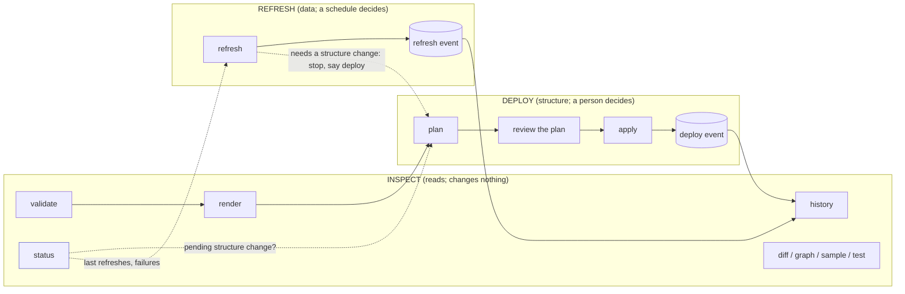
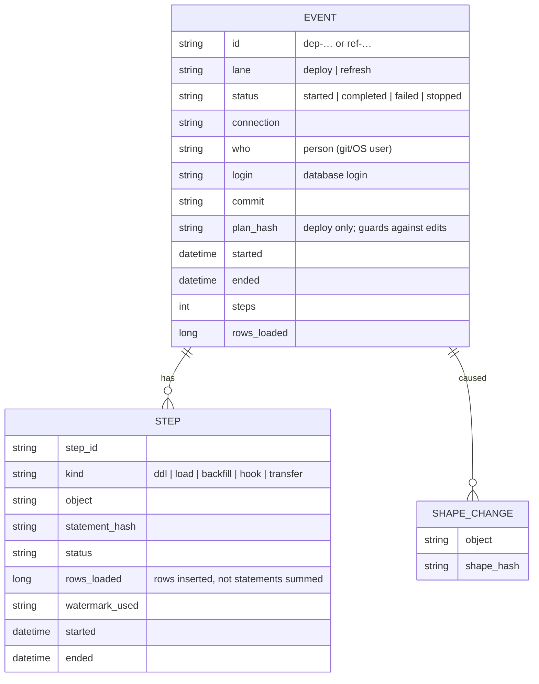
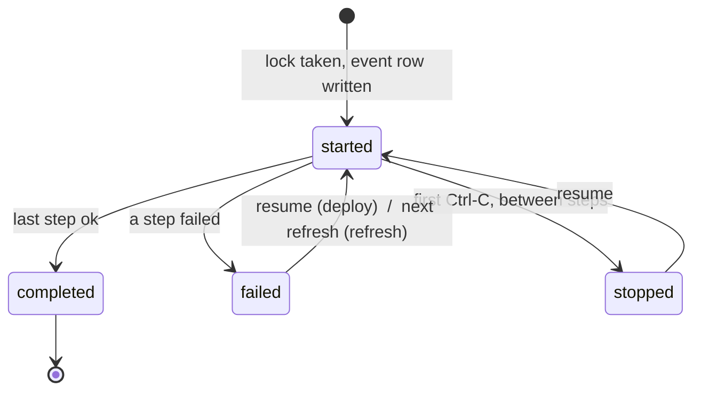

# Deploy and refresh: one model for the verbs, the records and the interfaces

Status: **draft for the owner's review** (2026-10-07). Nothing here is built. It follows from a walk through `plan`, `apply`, `run`, `report` and the statement log against a real SQL Server (progress log entry 130) that found the system working but assembled, not designed: five overlapping records of one event, two flows sharing one path, and a scheduled refresh that fails from its second run of the day.

## 1. The idea in one picture

There are two things a person does with this tool, and they differ in almost everything:

* **Deploy** changes what exists: tables, views, columns, indexes, hooks. It is rare, reviewed by a person, risky in proportion to what it changes, and should be committed with the code that caused it.
* **Refresh** moves data through what already exists. It is frequent, unattended, repeats the same statements, and must never change structure. A refresh that would need a structure change stops and says "deploy first".

Everything else (looking, checking, accepting a difference) belongs to **Inspect**, which changes nothing in the target.

## 2. The matrix

| | **DEPLOY** | **REFRESH** |
|---|---|---|
| **Question it answers** | "Make the database look like the models." | "Bring the data up to date." |
| **Who / what starts it** | a person (CLI, terminal, web, an agent with their approval) | a scheduler, or a person who wants fresh data now |
| **How often** | when a model, index or hook changes | every few minutes to daily |
| **Verbs (today → proposed)** | `plan`, `apply`, `apply --resume`, `ack` → `plan`, `apply`, `resume`, `ack` | `run` → `refresh` (`run` stays as an alias) |
| **Can change structure?** | yes: DDL, indexes, hooks | **never**; refuses and points at deploy |
| **Can move data?** | yes, as part of a model's first load or a backfill; `plan --structure-only` for none | yes: the routine loads, incremental or full |
| **Review step** | **required**: the plan report is read, risky and destructive steps need explicit allowances | none by default; the first run of a new model is a deploy |
| **Artifact** | a plan (`.plan.yml` + `.plan.md`), committed with the change | none in the project: a *run record* in the tracking tables |
| **Identity** | `dep-<utc time>-<4 hex>`; the plan's content hash is separate and only guards against edits | `ref-<utc time>-<4 hex>` |
| **"Applied once" rule** | per deploy event (a plan file is applied once) | none: every refresh is a new event |
| **Locks** | one deploy or refresh per connection at a time (application lock) | same lock; a refresh that finds a deploy running waits or exits `busy` (exit code 4) |
| **Allowances** | `--allow-risky`, `--allow-destructive <obj>` | none; a refresh with a risky step is refused |
| **Questions** | asked at plan time (history of a new column, runtime parameters) | none: a refresh needing an answer is a deploy |
| **Drift** | blocks the object; `ack drift` or restore | stops that model, continues the others, exit code 1 |
| **Failure** | stops at the step; `resume` continues; the report says which step and why | the model's step fails, the event is `failed`, the next refresh retries from the recorded watermark |
| **Stop** | first Ctrl-C finishes the running step, second aborts | same |
| **Tracking record (database)** | one *deploy event* row + its steps + the shape history it caused | one *refresh event* row + its loads (rows loaded, watermark, ranges) |
| **Statement log (local)** | every DDL/data statement, written before it is sent | every data statement; **not** the tracking writes (they are the record) |
| **Plan text kept** | in the event row (so history can show what ran) | not needed: the statements are the rendered files at the commit recorded |
| **Who** | the person (git user or OS user), the login, the commit | the schedule's account, the login, the commit |
| **History view** | `history --deploys` | `history --refreshes` |
| **What the report answers** | "What changed, when, by whom, from which commit, and did it finish?" | "Is the data fresh? What failed? How many rows? How long?" |
| **Retention** | plan files: git. Event rows: kept | event rows: kept (small); statement logs: `retention.statement_logs` (default 30 days) |
| **Exit codes** | 0 ok, 1 findings/refused, 2 usage, 4 busy | same |
| **Agents (MCP)** | read tools always; `plan` offered; `apply` only with `--allow-writes` and the person's approval | `refresh` only with `--allow-writes` and approval |
| **Web / MCP app** | **Deploy** tab: plans, review, Apply button (typed confirmation) | **Refresh** tab: freshness per model, last events, Run now |
| **Terminal** | menu group "Deploy" | menu group "Refresh" |

Shared rows, the same for both lanes: the effect class in every header, the exit codes, `--format json` with the same envelope, the scrubbed error text (type and number only), the application lock, and the tracking tables as the one durable record.

## 3. What is wrong today, against this matrix

| Matrix row | Today | Effect |
|---|---|---|
| Identity / applied-once | plan id = date + content hash, "applied once" | **a scheduled refresh with unchanged content fails with DDB-438 from its second run of the day** |
| Artifact (refresh) | `run` writes a plan file into `plans/` every time | clutter in git, ~250 KB per run |
| Tracking record | `migration_log` start + completed rows, plus `ddl_log`, `run_log` rows | one event is four kinds of rows; `report` shows them in separate tables |
| Rows loaded | sum of the row counts of every statement in the load script | 251 rows are reported as 502 |
| Statement log | includes the tool's own tracking writes (33 of 53 pairs in one apply) | the log is the same information as the tables, twice |
| Who | the database login (`sa`) | the person is only in git |
| Structure vs data | one plan holds both; no structure-only plan | a deploy of a big incremental model reloads it |
| Retention | none | logs and plan files pile up |
| Hints | a "Review the report…" line after `plan` and little else | the next step has to be remembered |

## 4. One event model

Every `apply` or `refresh` is one **event**. This replaces `migration_log` (as the thing people read), and the other logs hang under it.

`schema_version` (shape history), `block_log` (acknowledgements), `operation_interval` (ranges) and `metadata_document` stay as they are; they are keyed to an event id instead of a plan id. A tracking layout upgrade (`init --upgrade`, layout 5) adds the event table and keeps the old rows readable.

Lifecycle of an event:

## 5. The verbs

Seven verbs carry everything a person does day to day, in three groups. Everything else (`define`, `import`, `sample`, `test`, `graph`, `diff`, `new`, `seed`, `load-seeds`, `matrix`, `explain`, `agent-kit`, `metadata`, `publish-metadata`) is authoring or analysis and keeps its place.

| Group | Verb | Does | Replaces / renames |
|---|---|---|---|
| **Inspect** | `status` | the landing view: pending structure change, drift, freshness of each model, last events, what needs attention, and the **next step** | `check` + the top of `report` |
| | `history` | the timeline of events; `history <event id>` shows one event with its steps and statements | the tables of `report` |
| | `validate`, `render` | offline checks and generated files | unchanged |
| **Deploy** | `plan` | read the target, write a plan, list questions | unchanged; adds `--structure-only` |
| | `apply <plan>` | run a plan | unchanged; event id replaces plan id as the "once" rule |
| | `resume <event>` | continue a stopped or failed deploy | `apply --resume` (kept) |
| | `ack` | record a decision (drift, definition, history) | unchanged |
| **Refresh** | `refresh` | the routine loads, now | `run` (kept as an alias) |

`report` stays for one release as an alias for `status` + `history`.

## 6. Hints and context in every interface

The rule: **a person should never have to remember what comes next or which lane they are in.**

| Surface | Hint |
|---|---|
| Every CLI header | `lane: deploy` / `refresh` / `inspect`, the effect class, the connection, the event id, the commit |
| Every CLI ending | a `Next:` block of 1 to 3 runnable commands (`Next: dbdatabuild apply plans/...`, `Next: dbdatabuild status`) |
| Errors and refusals | the sentence, the cause in the person's words, and the `Next:` command that fixes it (`DDB-424 → Next: dbdatabuild render --write`); one error per cause, not one per file |
| `plan` | a summary block first: *N objects change, M loads, K risky, L destructive, Q questions*, then the statements |
| `status` | traffic-light lines per area: **Structure** (in sync / N pending / drift on X), **Data** (fresh / stale since T / failing), **Attention** (items with the command to clear each) |
| Terminal | the main menu is the three groups; the footer shows the current connection, the lane and the key for "what next" |
| Web / MCP app | three tabs (Status, Deploy, Refresh) and History; a lane chip (colour and word, not colour alone) on every screen; the same `Next` list as buttons |
| MCP tools | descriptions start with `[inspect]`, `[deploy]` or `[refresh]`; results carry `next` (the commands, not prose) so an agent offers the right one |
| JSON | `lane`, `event`, `next: [...]` in the envelope |
| Docs | `docs/commands.md` is grouped by lane; this page is the map |

## 7. Decisions for the owner

1. **Names.** `refresh` for `run`, `status`/`history` for `check`/`report`, `resume` for `apply --resume`: yes, no, or other words? (One word per concept applies: "event" is the unit; the plan stays the artifact of a deploy.)
2. **Event ids** in the form `dep-…` / `ref-…`: acceptable, or one `evt-…` for both?
3. **A refresh writes no plan file.** The statements it ran are in the tracking tables' step rows (hash) and the statement log (text); the rendered files at the recorded commit are the source. Is that enough for audit, or should a refresh keep a plan-shaped record?
4. **Structure-only deploys** (`plan --structure-only`) and the converse (a deploy that never loads): both, one, neither?
5. **Who** is recorded as the git user, else the OS user, else the login; settable with `--by`. Acceptable?
6. **Statement log retention** default (30 days proposed) and whether the log keeps tracking writes (proposed: no).
7. **Layout 5** (the event table) is a tracking upgrade like layout 4: acceptable as the next breaking step?
8. **Exit code 4 (busy)** for "another deploy or refresh holds the lock" so schedulers can tell it from a failure.

## 8. Order of work, if this is accepted

1. Event id and the "once" rule (fixes the scheduled-refresh failure), and `rows_loaded` (fixes the doubled row counts). Small, no layout change if the id is stored in the existing `plan_id` column first.
2. `refresh` without a plan file; `Next:` blocks and one-error-per-cause in `plan`.
3. Layout 5 event table, `status` and `history`.
4. The terminal menu, the web tabs and the MCP tool descriptions and `next` fields, from the same `next` data.
5. Retention settings.
6. `docs/commands.md` and the getting-started guide regrouped by lane.
