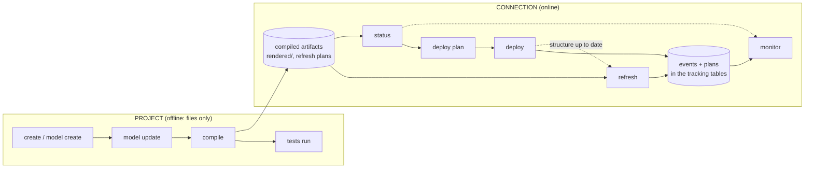
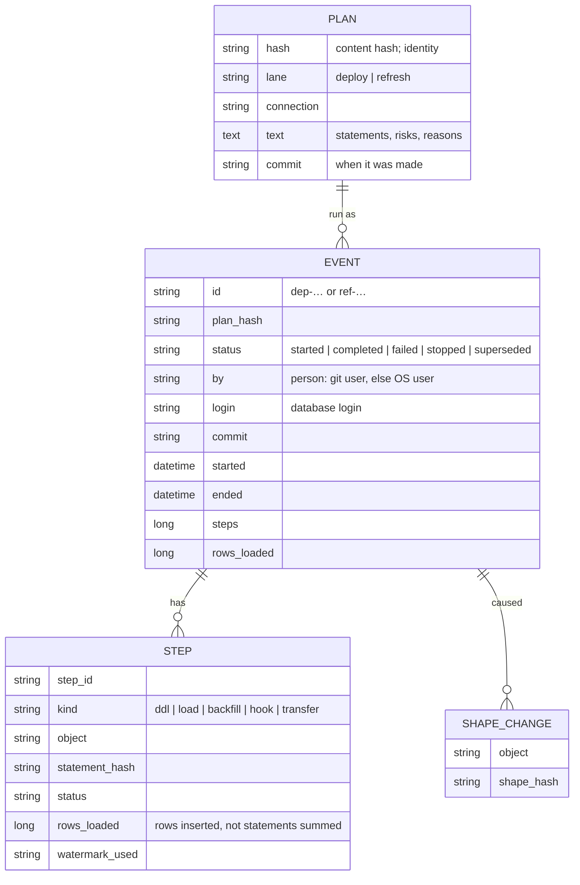
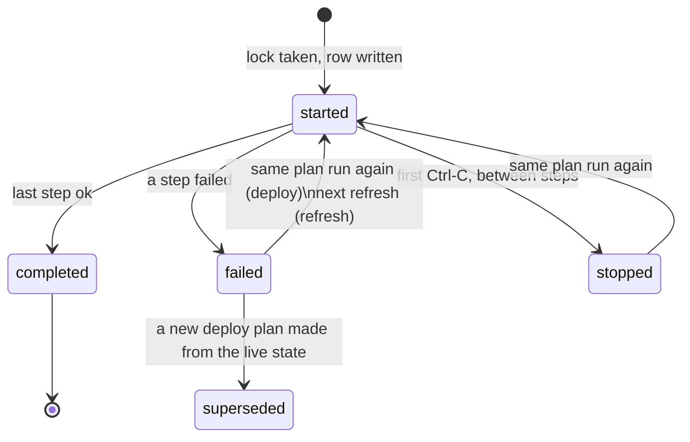

# The lifecycle model: project and connection, deploy and refresh

Status: **design, 2026-10-07.** Written from the owner's conceptual table and the review in progress-log entry 130. Where a choice was the owner's it says *owner*; where I filled a gap it says *proposed* and is open to change. The plan to build it is `docs/research/lifecycle-implementation.md`; the version for people who use the tool is `docs/concepts.md`. Nothing here describes the tool as it is today unless it says *today*.

> **As built, 2026-10-08.** Most of this is built (`docs/research/lifecycle-implementation.md` has the status per phase). Where the build differs from the text below:
>
> * The connection is chosen with `--connection <c>`, not as a positional argument.
> * `connection refresh` takes `models` (names or patterns), `--check`, `--on-fail`, `--allow-dirty` and `--dry-run`. It has no `--backfill`, `--allow-risky` or `--param`: a refresh runs routine loads only, and a backfill is a deploy (`connection deploy --backfill model=operation`).
> * The event is the row of `migration_log` (section 6): tracking layout 5 added `lane` and `project_hash` to it and the `plan_store` table. There is no `event_log` table. `plans.deploy.keep: database` is built for deploy (a refresh plan is compiled and committed; its `keep` is not acted on). A refresh's id is `ref-<utc>-<4 hex>`; a deploy keeps the content id of its plan.
> * `plans.deploy.require_clean_tree` is true by default (a deploy or a refresh from a tree with changes is refused unless `--allow-dirty`).
> * `audit` below `full` stores no text; below `standard` also no person and no commit. The column-history report reads decisions from stored plan text, so it needs `full`.
> * A refresh does not run the test gate, record native definitions or store metadata; those belong to deploy.
> * Not built: `connection tests run`, `connection monitor --plan`, the decision to check a refresh with `--check project` against a deploy of part of the project (the project hash is that of the whole connection).
> * `ui` has `terminal`, `web` and `mcp`.

## 1. The model in one page

Everything the tool does is an **action** on one of two **targets**:

* **project**: the directory of models. Actions here are *offline*: they read and write files, never a database. (One exception, `project import`, reads a connection to write files; see section 5.)
* **connection**: a database the project is built on. Actions here are *online*: they read, and some change, the database and its tracking tables.

Development is the project; runtime is the connection. Offline/online and development/runtime are not separate choices: they follow from the target.

The four things a person asks of a connection are **status** (where does it stand), **deploy** (change its structure), **refresh** (update its data) and **monitor** (what happened). Deploy and refresh are the two **lanes**; status and monitor look at them.

The artifacts form a chain, and each action takes only what the one before it produced:

| Action | Takes | Produces |
|---|---|---|
| `project compile` | the project's models, definitions and settings | compiled artifacts: lowered queries, rendered scripts, **refresh plans** |
| `connection status` | the compiled artifacts and the connection's live state | a report; with `--write-plan` (through `deploy`) a **deploy plan** |
| `connection deploy` | a deploy plan (made on the spot, or given with `--apply-plan`) | an event, the structure changes, the shape history |
| `connection refresh` | a refresh plan (a compiled artifact) | an event, the data changes |
| `connection monitor` | the events, plans and logs in the tracking tables | the report |

## 2. Disposition: what a command reads and writes

Every command has a **disposition**, printed in its header and in `--help`. It answers "can I run this safely?" at a glance.

| Code | Reads | Writes | Meaning |
|---|---|---|---|
| `P→` | project | nothing | reads the project; changes nothing anywhere |
| `P⇒P` | project | project files | edits or generates files in the project |
| `C→` | connection | nothing | reads the database (catalog, tracking tables, data digests); changes nothing |
| `C→P` | connection | project files | reads the database to write files (`project import`) |
| `P⇒T` | project | tracking tables | writes metadata or a decision to the tracking tables; no user data or structure |
| `P⇒S` | project, connection | **structure** (DDL) and tracking | changes what exists |
| `P⇒D` | project, connection | **data** (DML) and tracking | moves data through what exists |
| `—` | nothing | nothing | reference text, or a server that hosts other commands |

The older **effect class** (offline only, repo files only, target read-only, tracking tables only, target writes) maps onto these one for one and is kept in the JSON documents; the disposition is the name people see.

## 3. The command tree

Every command prints its lane and disposition. `<c>` is a connection name (omit it when the project has one default connection).

| Target | Command | Lane | Disposition | Replaces (today) |
|---|---|---|---|---|
| **project** | `project create <dir>` | — | `P⇒P` | `new` |
| | `project model create <schema.object>` | — | `P⇒P` | new (a scaffold) |
| | `project model update [models]` | — | `P⇒P` | `define` |
| | `project compile [models]` | — | `P⇒P` | `validate` + `render` |
| | `project tests run [tests]` | — | `P→` | `test` |
| | `project tests list` | — | `P→` | new |
| | `project sample <models>` | — | `P→` | `sample` |
| | `project seed` | — | `P⇒P` | `seed` |
| | `project import <c> [tables]` | — | `C→P` | `import` |
| | `project show loads\|graph\|metadata\|plan` | — | `P→` | `loads`, `graph`, `metadata`, `review` |
| | `project agent-kit` | — | `P⇒P` | `agent-kit` |
| **connection** | `connection inspect <c>` | — | `C→` | new |
| | `connection init <c>` | — | `P⇒T` | `init` |
| | `connection status <c> [models]` | inspect | `C→` | `check`, the top of `report` |
| | `connection deploy <c> [models]` | **deploy** | `P⇒S` | `plan`, `apply`, `ack`, `--resume` |
| | `connection refresh <c> [models]` | **refresh** | `P⇒D` | `run` |
| | `connection monitor <c>` | inspect | `C→` | `report`, `review` of stored plans |
| | `connection compare <c> <table>` | inspect | `C→` | `diff` |
| | `connection tests run <c>` | — | `C→` | new (not before the offline one is settled) |
| | `connection seed <c>` | — | `P⇒S` | `load-seeds` |
| | `connection publish <c> [models]` | — | `P⇒T` | `publish-metadata` |
| **ui** | `ui terminal` | — | `—` | `tui` |
| | `ui web` | — | `—` | `web` |
| | `ui mcp` | — | `—` | `mcp` |
| **help** | `help code <code>` | — | `—` | `explain` |
| | `help matrix` | — | `—` | `matrix` |

*Owner:* the target nouns, `status`, `deploy`, `refresh`, `monitor`, `help code`, `ui …`, `connection inspect`, `tests run`, no `doctor`, no old aliases. *Proposed:* `project model create|update` (the owner wrote `project create model` and `project update`), `project show …`, `connection compare|seed|publish`, `project import`.

Old verbs are **removed**, not aliased (owner): this is a new project with sample projects only.

### The two lanes, side by side

| | **DEPLOY** (structure) | **REFRESH** (data) |
|---|---|---|
| Question | "make the database look like the models" | "bring the data up to date" |
| Started by | a person (CLI, terminal, web, an agent with approval) | a scheduler, or a person who wants fresh data |
| Frequency | when a model, index or hook changes | minutes to daily |
| Command | `connection deploy` | `connection refresh` |
| Can change structure | yes | **never**; it stops and says "deploy first" |
| Can move data | yes (first loads, backfills) | yes (the routine loads) |
| Plan | made from the live state; can go stale | compiled offline; does not depend on live state |
| Plan made by | `connection deploy` (interactive, or `--write-plan`) | `project compile` |
| Reviewed | by whoever the project's process says (tracked, not dictated) | in version control, like code |
| Questions | asked while the plan is made | none: a refresh that needs an answer is a deploy |
| Allowances | `--allow-risky`, `--allow-destructive` | `--allow-risky` for a backfill only |
| Safety check before running | the plan's own staleness check | the **refresh check** (section 8) |
| Event id | `dep-<utc>-<4 hex>` | `ref-<utc>-<4 hex>` |
| Failure | stops at the step; running the same plan again resumes | the failed step is recorded; the next refresh retries |
| Stop | first Ctrl-C ends after the running step | same |
| History | `connection monitor --lane deploy` | `connection monitor --lane refresh` |

## 4. Plans and events

A **plan** is a list of steps, each with its statements, risk and reasons, identified by the hash of its content. An **event** is one run of a plan. The two are separate on purpose: ten refreshes in a day are ten events that point at one plan.

Event states:

Rules:

* A **completed** deploy plan cannot be applied again (the message names the event). A refresh plan can be run any number of times: each run is a new event.
* Running a deploy plan that has an incomplete event **continues it** after checking that the live objects are in the recorded intermediate state; if not it stops and names the differences. There is no `--resume` flag (owner).
* A new `connection deploy` makes its plan from the live state, so a half-applied earlier deploy is accounted for; the old event is marked `superseded`.
* `rows_loaded` of a step is the rows **inserted by the load**, not the sum of the row counts of every statement of its script.

## 5. Where plans live: the plan policy

*Owner:* every plan can be stored in the database so the event that ran it can refer to it; a deploy plan may live only in the database, or be ephemeral; the project settings say how a project is meant to operate and what auditing it needs. The tool tracks what happened to match the policy; it does not dictate who reviews or approves.

| `keep` | File in the project | Row in the tracking tables | Use |
|---|---|---|---|
| `committed` | yes (deploy plans in `plans/`, refresh plans under `rendered/`) | yes | reviewed in a pull request |
| `database` | no | yes | made by one person or job, applied by another; no files |
| `ephemeral` | no | the hash only | dev: made and applied in one step, nothing kept |

| `audit` | Kept for every event |
|---|---|
| `minimal` | the event and its steps |
| `standard` | adds the plan hash, who and the commit |
| `full` | adds the plan text (in the content-addressed plan table), and the statement log for the retention period |

Defaults: deploy `committed`/`full`; refresh `committed`/`standard`. Both can be overridden per connection. `connection status` states the policy in force, and `project compile --check` fails when a committed refresh plan is out of date.

A refresh plan is a compiled artifact (`rendered/<connection>/refresh.plan.yml`): the loads in dependency order, their statement hashes, and a `requires` block (section 8). It holds no value that is only known at run time (watermarks, resolver results); those are recorded in the event's steps. It is committed as documentation of how the project operates every day.

## 6. The tracking tables and the local logs

| Record | Where | Holds | Written by |
|---|---|---|---|
| plan | tracking table `plan_store` (content-addressed) | the plan text, once per hash | deploy, refresh (per policy) |
| event | tracking table `event_log` | one row per run | deploy, refresh |
| step | tracking tables `ddl_log`, `run_log` (keyed by event) | one row per statement of a deploy, one per load | deploy, refresh |
| shape history | `schema_version` | every shape hash an object has had, with the event | deploy |
| decisions | `block_log` | acknowledgements with reason and person | `deploy --ack` |
| ranges | `operation_interval` | the ranges a load produced | deploy, refresh |
| metadata | `metadata_document` | JSON documents about the project | `connection publish` |
| statement log | `.dbdatabuild/statement-log/*.jsonl` (local) | each DDL and data statement, written **before** it is sent, with its outcome | deploy, refresh |

The statement log is the pre-send safety net (a statement is not sent unless it is logged first). It no longer records the tool's own tracking writes, which are the tracking tables. It is pruned by `retention.statement_logs_days`.

## 7. Lookup: terms

| Term | Meaning | Where it appears |
|---|---|---|
| project | the directory of models, definitions, tests and settings | `project …`, `--project` |
| connection | a named database the project is built on, with an engine | `connection …`, `<c>`, `defaults.connections` |
| engine | the SQL dialect of a connection: `sqlserver`, `postgres`, `fabric` | `connections.<c>.engine` |
| lane | deploy or refresh | headers, `--lane`, event ids |
| disposition | what a command reads and writes (section 2) | headers, `--help`, JSON `disposition` |
| effect class | the older name for the disposition; kept in JSON | JSON `effect` |
| plan | a list of steps, identified by its content hash | files, `plan_store` |
| event | one run of a plan | `event_log`, `monitor` |
| step | one statement (deploy) or one load (refresh) of an event | `ddl_log`, `run_log` |
| compiled artifacts | what `project compile` writes: lowered queries, rendered scripts, refresh plans | `rendered/` |
| refresh plan | the compiled list of routine loads for a connection | `rendered/<c>/refresh.plan.yml` |
| deploy plan | the list of structure changes (and first loads) made from the live state | `plans/<c>/<id>.plan.yml`, `plan_store` |
| keep | where a plan lives: `committed`, `database`, `ephemeral` | `plans.*.keep` |
| audit | how much is recorded: `minimal`, `standard`, `full` | `plans.*.audit` |
| refresh check | the safety check run before a refresh: `none`, `project`, `objects`, `live` | `refresh.check`, `--check` |
| shape hash | the hash of an object's columns, types and nullability | plans, `schema_version` |
| project hash | the hash of the expected shape hashes of the objects a refresh plan loads | refresh plan `requires` |
| drift | an object changed outside the tool | `status`, `deploy --ack drift:…` |
| acknowledgement (ack) | a recorded decision, with a reason, tied to one hash | `block_log`, `deploy --ack` |
| allowance | permission given to run a risky or destructive step | `--allow-risky`, `--allow-destructive` |
| backfill | reloading historical ranges of an incremental model | `--backfill model=operation` |
| selector | a way to name models: name, `+model`, `model+`, `kind:`, `tag:`, `connection:`, `path:`, `changed:<ref>`, `exclude:` | arguments `[models]` |
| mapped model | a table that exists and the tool does not build | `kind: {type: mapped}` |
| native model | a table the engine computes from its own query | `kind: {type: native}` |
| copy | a model that moves rows between connections | `kind: {type: copy}` |

## 7a. Lookup: settings

| Key (`dbdatabuild.yml`) | Values | Default | Meaning |
|---|---|---|---|
| `plans.deploy.keep` | `committed`, `database`, `ephemeral` | `committed` | where deploy plans live |
| `plans.deploy.audit` | `minimal`, `standard`, `full` | `full` | how much a deploy records |
| `plans.deploy.require_clean_tree` | `true`, `false` | `false` | refuse a deploy from a working tree with uncommitted changes (today `--allow-dirty` lifts it) |
| `plans.refresh.keep` | `committed`, `database`, `ephemeral` | `committed` | where refresh plans live |
| `plans.refresh.audit` | `minimal`, `standard`, `full` | `standard` | how much a refresh records |
| `connections.<c>.plans.<lane>.*` | as above | the project's | a connection's own policy |
| `refresh.check` | `none`, `project`, `objects`, `live` | `objects` | the safety check before a refresh |
| `refresh.on_fail` | `block`, `warn` | `block` | what a failed check does |
| `retention.statement_logs_days` | whole number, 0 = keep | 30 | local statement logs older than this are removed by the next deploy or refresh |
| `tracking.connection`, `tracking.schema` | as today | as today | where the tracking tables live |

## 8. The refresh check

*Owner:* a refresh must be *able* to run without querying the connection's metadata; the checks are levels the project and the command line choose.

A refresh plan carries a `requires` block: for each object it loads (and reads from the project's own tables), the shape hash the compiled project expects. The check compares that with something recorded or live.

| Level | Compares `requires` with | Queries the connection | Fails with |
|---|---|---|---|
| `none` | nothing; the engine's own errors are the check | no | the engine's error (type and number) |
| `project` | one hash over all `requires`, against the project hashes of the connection's **deploy events** | tracking tables only | "this project's structure was never deployed here; last deploy dep-… had hash …" |
| `objects` | each object's expected shape hash against the **latest recorded** shape hash | tracking tables only | the objects that are behind, with expected and recorded hash and the deploy event that last touched each |
| `live` | each object's expected shape hash against the **live** catalog | catalog and tracking tables | as `objects`, plus objects changed outside the tool |

The hash covers only the objects the plan touches, so an undeployed model nobody refreshes does not block the others. With `tracking: none` only `none` and `live` can be used. `on_fail: warn` reports and runs anyway.

## 9. Hints in every interface

*Owner:* as many visual and contextual hints as possible, and consistency across the CLI, the terminal, the web page and the MCP app.

| Surface | Hint |
|---|---|
| CLI header (every command) | `lane`, `disposition`, `connection`, `event id`, `commit` |
| CLI ending (every command) | a `Next:` block of one to three runnable commands |
| Errors and refusals | the sentence, the cause in plain words, the `Next:` command that fixes it; one error per cause |
| `deploy` | a summary first (*N objects change, M loads, K risky, L destructive, Q questions*), then the statements |
| `status` | three lines with a state each: **Structure** (in sync / N pending / drift on X), **Data** (fresh / stale since T / failing), **Attention** (each item with its command) |
| JSON | `lane`, `disposition`, `event`, `next: ["…"]` in the envelope |
| Terminal | menu groups Project, Connection (Status, Deploy, Refresh, Monitor), Interfaces; the footer shows connection, lane and the key for "what next" |
| Web page and MCP app | tabs Status, Deploy, Refresh, Monitor for a connection; a lane chip (word and colour); the `Next` list as buttons |
| MCP tools | descriptions start `[project]`, `[inspect]`, `[deploy]` or `[refresh]`; results carry `next` |

## 10. Exit codes

| Code | Meaning |
|---|---|
| 0 | done |
| 1 | findings: a refused plan, a failed step, a failed check, `status` found a difference |
| 2 | usage: a bad option or a missing file |
| 3 | not implemented |
| 4 | busy: another deploy or refresh holds the lock |
| 70 | internal error (a tool defect) |

## 11. Per-command reference (target)

Conventions: *Reads* and *Writes* name what the command touches. `<c>` may be omitted when the project has one default connection. Options marked **new** do not exist today. Every command also takes `--project <path>` (default `.`) and `--format text|json`; they are not repeated below.

### 11.1 project

#### `project create <directory>`  ·  `P⇒P`
Create a ready-to-run project from a template. Reads: the templates built into the executable. Writes: the new directory.

| Parameter | Kind | Default | Meaning |
|---|---|---|---|
| `directory` | argument | the template's name | where to write the project |
| `--template <name>` | option | `starter` | `starter`, `retail`, `chinook`, `adventureworks` |
| `--list` | flag | | list the templates and write nothing |

#### `project model create <schema.object>`  ·  `P⇒P`  ·  **new**
Scaffold a model: a definition file and, for a query kind, a query file. Reads: the project (to check the name is free). Writes: `models/…`.

| Parameter | Kind | Default | Meaning |
|---|---|---|---|
| `schema.object` | argument | | the model's name |
| `--kind <kind>` | option | `view` | `view`, `full`, `incremental_by_unique_key`, `incremental_by_time_range`, `copy`, `native`, `mapped` |
| `--from <schema.object>` | option | | for `copy`: the model it copies |
| `--connection <c>` | option | project default | the connections it is built on |

#### `project model update [models]`  ·  `P⇒P`  (today `define`)
Generate or update definition files from the queries. Reads: queries, definitions. Writes: definition `.yml` files (minimal edits; comments and key order survive).

| Parameter | Kind | Default | Meaning |
|---|---|---|---|
| `models` | argument, several | every model | model files, directories or names |
| `--check` | flag | | CI: fail if a definition is out of sync with its query; writes nothing |
| `--write` | flag | | non-interactive: write without asking (needs `--answers` for open questions) |
| `--answers <file>` | option | | answers to the questions |
| `--accept-inferred` | flag | | accept proposals marked high certainty |

#### `project compile [models]`  ·  `P⇒P`  (today `validate` + `render`)
Validate the project offline and write the compiled artifacts: lowered queries, rendered scripts per connection, refresh plans. Reads: models, definitions, settings, macros, seeds. Writes: `rendered/`.

| Parameter | Kind | Default | Meaning |
|---|---|---|---|
| `models` | argument, several | every model | selectors |
| `--check` | flag | | validate and compare with the committed artifacts; write nothing (CI) |
| `--connection <c>` | option, several | all | compile only for these connections |
| `--content` | flag | | with JSON: put each file's text in the document |

#### `project tests run [tests]`  ·  `P→`  (today `test`)
Run metadata rules and model tests in DuckDB. Reads: project, `tests/`. Writes: nothing.

| Parameter | Kind | Default | Meaning |
|---|---|---|---|
| `tests` | argument, several | every test | test names or files |
| `--kind <kind>` | option | both | `metadata` or `model` |
| `--tag <tag>` | option, several | | run tests with any of these tags |
| `--limit <n>` | option | 5 | violating rows shown per test |
| `--strict` | flag | | fail on warning-severity tests |

#### `project tests list`  ·  `P→`  ·  **new**
List the tests with kind, tags and severity. Reads: `tests/`. No other parameters.

#### `project sample <models>`  ·  `P→`  (today `sample`)
Run models on generated or supplied data. Reads: project, seeds, CSV files. Writes: nothing.

| Parameter | Kind | Default | Meaning |
|---|---|---|---|
| `models` | argument, several | every model | selectors |
| `--rows <n>` | option | 20 | rows generated per source |
| `--limit <n>` | option | 10 | rows shown per result |
| `--seed <n>` | option | 1 | generator seed |
| `--scale <n>` | option | the project's | scale variable for seeded sources |
| `--data <dir>` | option | | CSV files named after sources, instead of generated rows |
| `--sources` | flag | | also show the source tables |

#### `project seed`  ·  `P⇒P`  (today `seed`)
Run the seeds into a DuckDB file. Reads: `seeds/`. Writes: `.dbdatabuild/seed.duckdb`.

| Parameter | Kind | Default | Meaning |
|---|---|---|---|
| `--out <file>` | option | `.dbdatabuild/seed.duckdb` | the DuckDB file |
| `--seed <n>`, `--scale <n>` | option | | as `project sample` |

#### `project import <c> [tables]`  ·  `C→P`  (today `import`)
Export tables and views of a connection as mapped models. Reads: the catalog (read login). Writes: `models/…` with `--write`.

| Parameter | Kind | Default | Meaning |
|---|---|---|---|
| `c` | argument | project default | the connection to read |
| `tables` | argument, several | the descriptors the project has | `schema.table` patterns with `*` and `?` |
| `--write` | flag | | write the new and changed mapped models |
| `--check` | flag | | CI: fail if a descriptor differs from its table; writes nothing |

#### `project show <what>`  ·  `P→`
Read-only views of the project.

| `what` | Shows | Parameters | Replaces |
|---|---|---|---|
| `loads` | the model × connection × operation table with matrix status | | `loads` |
| `graph [models]` | the dependency graph | `--columns`, `--column <model.column>`, `--diagram dot\|mermaid`, selectors | `graph` |
| `metadata [models]` | everything the tool knows about the models | selectors | `metadata` |
| `plan [file]` | a plan file: steps, risk, statements, report, whether intact, what applying needs; omit the file to list the project's plans | `--connection <c>` when listing | `review` |

#### `project agent-kit`  ·  `P⇒P`  (today `agent-kit`)
Install the skill and schemas an AI agent needs. Writes: `.claude/skills/dbdatabuild/` (and `.mcp.json` with `--mcp`).

| Parameter | Kind | Default | Meaning |
|---|---|---|---|
| `--write` | flag | | install (default: list the files) |
| `--check` | flag | | CI: fail if the installed kit differs |
| `--dir <path>` | option | `.claude/skills/dbdatabuild` | where to install |
| `--mcp` | flag | | also add the MCP server to `.mcp.json` |

### 11.2 connection

#### `connection inspect <c>`  ·  `C→`  ·  **new**
Find out what the tool can do with this connection and why not. Reads: the server's properties, the catalog and the tracking tables, with the read login; with `--write-login` it also opens (and closes) a connection with the write login. Writes: nothing.

| Parameter | Kind | Default | Meaning |
|---|---|---|---|
| `c` | argument | project default | the connection |
| `--write-login` | flag | | also try the write login |

Reports, each with a state and a fix: both logins present; the server reachable and its version and compatibility level; the read login's rights (catalog, the tracking schema name); the write login's rights (create schema, create table) if tried; the tracking tables and their layout version; the database collation, time zone and language; whether the application lock can be taken. Never prints a driver message, only the type and the error number.

#### `connection init <c>`  ·  `P⇒T`  (today `init`)
Create the tracking tables. Reads: the catalog. Writes: the tracking tables (with `--apply`).

| Parameter | Kind | Default | Meaning |
|---|---|---|---|
| `--apply` | flag | | run the script on the write login (default: print it) |
| `--upgrade` | flag | | bring tracking tables of an older layout to this one first |

#### `connection status <c> [models]`  ·  `C→`  (today `check`, the top of `report`)
Where does the connection stand. Reads: compiled artifacts, the live catalog, the tracking tables. Writes: nothing. Exit 1 when anything differs.

| Parameter | Kind | Default | Meaning |
|---|---|---|---|
| `models` | argument, several | every model of the connection | selectors |

Shows: **Structure** (in sync, pending changes, drift), **Data** (per model: last refresh, rows, stale or failing), **Attention** (decisions to record, incomplete events, failed steps), the plan policy in force, and the `Next:` commands.

#### `connection deploy <c> [models]`  ·  `P⇒S`  (today `plan`, `apply`, `ack`, `--resume`)
Change the connection's structure. By default **interactive**: shows the differences, asks the questions, shows the plan, asks for the allowances, applies. Reads: compiled artifacts, the live catalog, the tracking tables. Writes: structure, the first loads, the tracking tables, the plan per the policy.

| Parameter | Kind | Default | Meaning |
|---|---|---|---|
| `models` | argument, several | every model of the connection | selectors |
| `--write-plan` | flag | | make the plan, store it as the policy says, and stop |
| `--apply-plan <file or id>` | option | | run an existing plan (hash and staleness checked); continues an incomplete event of it |
| `--answers <file>` | option | | answers to the plan's questions |
| `--param <model.op.name=value>` | option, several | | a runtime parameter of a load |
| `--accept-inferred` | flag | | accept proposals marked high certainty |
| `--ack <kind:name>` | option, several | | record a decision: `drift:<object>`, `definition:<model>`, `history:<model.column>`; needs `--reason`; alone it records and stops |
| `--reason <text>` | option | | why the decision is accepted (recorded with the person) |
| `--allow-risky` | flag | | allow the plan's risky steps |
| `--allow-destructive <object>` | option, several | | allow an object's destructive steps |
| `--allow-dirty` | flag | | run from a working tree with uncommitted changes (recorded) |
| `--backfill <model=operation>` | option, several | | plan that operation as a backfill (risky) |
| `--op <model=operation>` | option, several | | load a model with a non-default operation |
| `--full-refresh <model>` | option, several | | read an incremental copy's origins from the start |
| `--dry-run` | flag | | run every check and print every statement; execute nothing |
| `--yes` | flag | | do not prompt (CI); the allowances still have to be given |
| `--output <path>` | option | `plans/<c>/` | where a committed plan is written |

#### `connection refresh <c> [models]`  ·  `P⇒D`  (today `run`)
Run the connection's routine loads from the compiled refresh plan. Never changes structure. Reads: the refresh plan, (per the check level) the tracking tables and the catalog. Writes: data, the tracking tables.

| Parameter | Kind | Default | Meaning |
|---|---|---|---|
| `models` | argument, several | every model of the plan | selectors |
| `--check <level>` | option | `refresh.check` | `none`, `project`, `objects`, `live` |
| `--on-fail <action>` | option | `refresh.on_fail` | `block` or `warn` |
| `--backfill <model=operation>` | option, several | | include a backfill (risky; needs `--allow-risky`) |
| `--allow-risky` | flag | | allow a backfill |
| `--param <model.op.name=value>` | option, several | | a runtime parameter of a load |
| `--allow-dirty` | flag | | run from a working tree with uncommitted changes (recorded) |
| `--dry-run` | flag | | check and print the statements; execute nothing |

#### `connection monitor <c>`  ·  `C→`  (today `report`)
What happened on the connection. Reads: the tracking tables. Writes: nothing.

| Parameter | Kind | Default | Meaning |
|---|---|---|---|
| `--lane <lane>` | option | both | `deploy` or `refresh` |
| `--event <id>` | option | | one event: its steps, statements (hashes and the text if kept), rows, who |
| `--plan <hash or id>` | option | | one stored plan and the events that ran it |
| `--attention` | flag | | only what needs attention |
| `--last <n>` | option | 10 | events shown |

#### `connection compare <c> <table>`  ·  `C→`  (today `diff`)
Compare the data of two tables, of one connection or across connections and engines (by digests). Reads: the tables. Writes: nothing.

| Parameter | Kind | Default | Meaning |
|---|---|---|---|
| `table` | argument | | `schema.table` to compare |
| `--against <schema.table>` | option | | the other table |
| `--against-schema <schema name>` | option | | the same table under another schema name |
| `--against-connection <c>` | option | | the same table on another connection |
| `--key <columns>` | option, several | the model's grain or unique key | columns that identify a row |
| `--columns`, `--exclude-columns` | option, several | | narrow the comparison |
| `--show-values` | flag | | read and show values (default: counts only) |
| `--limit <n>` | option | 10 | sample rows per kind of difference |

#### `connection tests run <c>`  ·  `C→`  ·  **new, later**
Run tests against a real connection. Not designed further until `project tests run` is settled.

#### `connection seed <c>`  ·  `P⇒S`  (today `load-seeds`)
Create the seeded source tables on a sandbox connection and fill them.

| Parameter | Kind | Default | Meaning |
|---|---|---|---|
| `--apply` | flag | | do it (default: print what would happen) |
| `--replace` | flag | | drop and recreate an existing source table |
| `--seed <n>`, `--scale <n>` | option | | as `project seed` |

#### `connection publish <c> [models]`  ·  `P⇒T`  (today `publish-metadata`)
Store the project's metadata documents in the tracking tables.

| Parameter | Kind | Default | Meaning |
|---|---|---|---|
| `models` | argument, several | every model | selectors |

### 11.3 ui and help

| Command | Disposition | Parameters | Meaning |
|---|---|---|---|
| `ui terminal` | `—` | `--connection <c>` | the terminal interface |
| `ui web` | `—` | `--port <n>`, `--allow-apply` | the web page on the loopback address; without `--allow-apply` it reads and plans only |
| `ui mcp` | `—` | `--allow-writes`, `--allow-apply`, `--no-show` | the MCP server (tools, resources, prompts, the app); `--allow-writes` offers `deploy`, `refresh`, `init`, `seed`, `publish` to the model, each run needing the person's approval |
| `help code <code>` | `—` | `code` (for example `DDB-214`) | the long explanation of a diagnostic |
| `help matrix` | `—` | `--rewrites` | the support matrix, or the rewrites that make the engines give DuckDB's answers |

## 12. From the commands of today

| Today | Becomes |
|---|---|
| `new` | `project create` |
| `define` | `project model update` |
| `validate`, `render` | `project compile` (`--check` for CI) |
| `loads`, `graph`, `metadata` | `project show loads\|graph\|metadata` |
| `review` | `project show plan` (a file), `connection monitor --plan` (a stored plan) |
| `test` | `project tests run` |
| `sample`, `seed` | `project sample`, `project seed` |
| `import` | `project import <c>` |
| `agent-kit` | `project agent-kit` |
| `init` | `connection init` |
| `check` | `connection status` |
| `plan` | `connection deploy --write-plan` |
| `apply <plan>` | `connection deploy --apply-plan <plan>` |
| `apply --resume` | `connection deploy --apply-plan <plan>` (it continues by itself) |
| `ack` | `connection deploy --ack … --reason …` |
| `run` | `connection refresh` |
| `report` | `connection monitor`, `connection status` |
| `diff` | `connection compare` |
| `load-seeds` | `connection seed` |
| `publish-metadata` | `connection publish` |
| `tui`, `web`, `mcp` | `ui terminal`, `ui web`, `ui mcp` |
| `explain`, `matrix` | `help code`, `help matrix` |

## 13. Decided and proposed

| # | Item | State |
|---|---|---|
| 1 | Targets `project` and `connection`; actions as in section 3 | owner |
| 2 | `status` is the read-only look; `deploy` is interactive by default with `--write-plan` / `--apply-plan` | owner (the split of the two: proposed) |
| 3 | `ack` inside `deploy` | owner |
| 4 | No `--resume`; running the plan again continues it | owner |
| 5 | Refresh plans are compiled, committable artifacts; all plans may be stored in the database | owner |
| 6 | Plan policy: `keep` and `audit`, per lane and per connection | owner |
| 7 | No tool-dictated review or approval | owner |
| 8 | No `protected` connection flag | owner/proposed, dropped |
| 9 | Refresh check levels `none`, `project`, `objects`, `live` | owner |
| 10 | `connection inspect`; never `doctor`; `ping`, `check`, `validate` too narrow or too generic | owner |
| 11 | `project tests run`, `connection tests run`; bare `test` is ambiguous | owner |
| 12 | Old verbs removed, no aliases | owner |
| 13 | `help code`, `help matrix`, `ui terminal\|web\|mcp` | owner (`ui mcp`: proposed name) |
| 14 | `--backfill` in both lanes | owner |
| 15 | Event ids `dep-…`, `ref-…`; who = git user, else OS user | proposed |
| 16 | Layout 5 (`event_log`, `plan_store`); statement log without tracking writes; 30-day retention | proposed |
| 17 | `project model create\|update`, `project show`, `connection compare\|seed\|publish`, `project import` | proposed |
| 18 | Exit code 4 for busy | proposed |
| 19 | Default refresh check `objects` | proposed |
